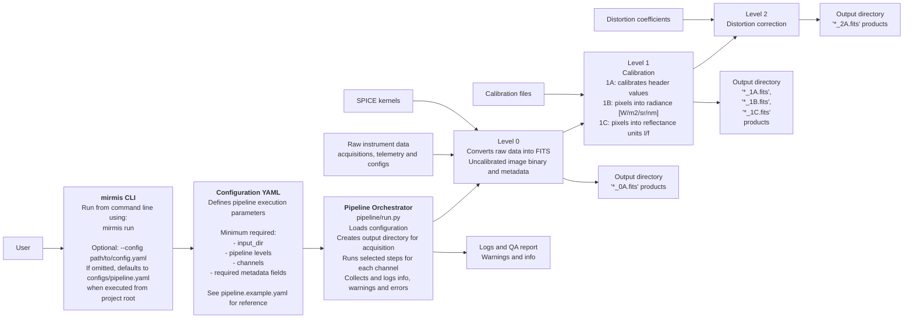

# Comet Interceptor MIRMIS NIR-MIR Pipeline #

## Overview
This repository contains the ground-processing pipeline for the MIRMIS instrument's NIR hyperspectral camera and MIR spectrometer of the ESA Comet Interceptor mission. The pipeline ingests raw binary instrumetn data and produces calibrated, structured data products, through multiple processing levels (0A, 1A, 1B, 1C, 2A), and generates PDS4 labels according to ESA standards. The pipeline is executed from command line using the 'mirmis' CLI iterface. (Later also from jupyter notebooks)

## Installation

### Requiremetns
- Python 3.12+
- uv (https://github.com/astral-sh/uv)
- C compiler (clang or gcc) (for decompressing JPEG 2000 files) 
- Jasper library (for decompressing JPEG 2000 files) 

### 1. Clone the repository

### 2. Create and activate a virtual environment
using uv:
```bash
uv venv
source .venv/bin/activate
uv sync
```

### compile jp2 decompressor
If the raw acquisition files are JPEG 2000 compressed the pipeline uses a C program as a subprocess.
If the files are not decompressed this is not needed.

install jasper if not installed (https://jasper-software.github.io/jasper-manual/latest/html/index.html)

from project root:
```bash
cd src/nirmir_pipeline/pipeline/levels/level_0
cc decompress.c -o decompress $(pkg-config --cflags --libs jasper)
```

## Repository structure
### Directpry structure
```text
MIRMIS-NIR-MIR-pipeline/
│
├── pyproject.toml # Project configuration and dependencies
├── uv.lock # Locked dependency versions
├── README.md
│
├── configs/ # YAML configuration files
│ ├── pipeline.yaml # If no configurations is provided this is retrieved first
│ └── pipeline.example.yaml
│
├── src/
│ └── nirmir_pipeline/
│   ├── cli.py # Command-line interface
│   ├── utils/
│   │ └── logging_config.py # Logger configuration file
│   └── pipeline/
│     ├── run.py # Pipeline orchestrator
│     ├── levels/
│     │       ├── level_0/ # Level 0 related files
│     │       ├── level_1/ # Level 1 related files
│     │       └── level_2/ # Level 2 related files
│     ├── pds4/    # PDS4 labels
│     ├── config.py # Config parsing 
│     ├── visualise.py # For visualising products
│     └── utils/ # Logging, helpers, shared classes
│
├── tests/ # Unit tests (pytest)
│
└── docs/ # Additional documentation and diagrams
```

### System overview diagram


## Configuration
The pipeline is controlled by a YAML configuration file.
By default, if executed from the project root, the pipeline looks for: configs/pipeline.yaml
A custom configuration file can be provided using the parameter --config path/to/config.yaml

### Minimal required fields
- input_dir: Path to the raw instrument data and telemetry (run object)
- levels: Processing levels to execute (pipeline object)
- channels: Instrumetn channels to process (pipeline object)
- Required meta data fields (data object)

### Optional fields
- output_dir: if not provided the pipeline will create outputs/{MISSPHAS}/ directory to the project root.
- spice_dir: The pipeline does not need spice kernel to run but its necessary for meaningful SPICE information

Check all the fields and examples from configs/pipeline.example.yaml

## Running the pipeline
The pipeline is run using 'mirmis' command-line interface

### Default execution
If executed from the project root and the configruation is locatd at: configs/pipeline.yaml

run: 
```bash
mirmis run
```

### Custom configuration file
To specify a different configuration file:
```bash
mirmis run --config path/to/config.yaml
```
the path can be absolute or relative from the project root.

### visualise FITS file
To visualise a FITS file:
```bash
mirmis run --path path/to/file.fits
```
The path can be absolute or relative from the project root.  
If the path is a directory of FITS files give the desired level as a --level parameter:
```bash
mirmis run --path path/to/fits_directory --level '0A'
```

## Outputs

## Contact
The repository is maintained by:  
Valtteri Pitkänen  
For direct communication, contat via email: valtteri.m.pitkanen@aalto.fi


